<!-- Generated by GitHub Profile Agent Console. Edit profile.config.json, then run npm run generate. -->

  <picture>
    <source media="(max-width: 760px) and (prefers-color-scheme: dark)" srcset="./assets/hero/agent-console-fec61967-mobile-dark.svg">
    <source media="(max-width: 760px)" srcset="./assets/hero/agent-console-fec61967-mobile-light.svg">
    <source media="(prefers-color-scheme: dark)" srcset="./assets/hero/agent-console-fec61967-dark.svg">
    <source media="(prefers-color-scheme: light)" srcset="./assets/hero/agent-console-fec61967-light.svg">
    
  </picture>

  
  
  

## About Me

I build modern web and mobile applications with a strong focus on React Native, React, Next.js, TypeScript, and Node.js.

My work combines software architecture, performance, testing, and CI/CD to build reliable, scalable, and maintainable products.

## Current Focus

| Area | What I am exploring |
| --- | --- |
| **React Native** | Building cross-platform mobile applications for Android and iOS with scalable and maintainable architectures. |
| **Full Stack Development** | Developing modern web applications and APIs using React, Next.js, Node.js, TypeScript, and databases. |
| **Software Architecture** | Applying Clean Architecture, MVVM, MVC, and scalable patterns to build maintainable software. |

## Featured Work

| Project | Focus | Why it matters |
| --- | --- | --- |
| [**Moreira Pizzas**](https://github.com/devdenismoreira/sistem-moreira-pizzas) | Web application | A web application project focused on building a practical business system with modern web development technologies. |
| [**WebCarros**](https://github.com/devdenismoreira/projeto_webcarros) | Web application | A web application focused on vehicle listings and marketplace functionality. |
| [**DSM Store**](https://github.com/devdenismoreira/dsm-store) | E-commerce | An e-commerce project focused on product browsing and modern frontend development. |
| [**API Pizzaria**](https://github.com/devdenismoreira/api-pizzaria) | Backend API | A backend API project demonstrating REST API development, backend architecture, and data management. |
| [**Dev Helpdesk**](https://github.com/devdenismoreira/dev-helpdesk) | Full Stack | A helpdesk application focused on support request management and full stack application development. |

## Research Direction

I am interested in building reliable software systems with clean architecture, maintainable code, strong testing practices, and efficient development workflows.

## Tech Stack

`TypeScript` · `JavaScript` · `React` · `React Native` · `Next.js` · `Node.js` · `NestJS` · `Express` · `PostgreSQL` · `MySQL` · `MongoDB` · `Prisma` · `Docker` · `AWS` · `GitHub Actions` · `Jest` · `Vitest` · `React Testing Library`

## Recent Activity

<!-- AUTO:ACTIVITY:START -->
_Recent public activity will appear here after the workflow runs._
<!-- AUTO:ACTIVITY:END -->

---

  Building scalable software and sharing what works.

