<!-- Generated by GitHub Profile Agent Console. Edit profile.config.json, then run npm run generate. -->

  <picture>
    <source media="(max-width: 760px) and (prefers-color-scheme: dark)" srcset="./assets/hero/agent-console-6a1e7e9a-mobile-dark.svg">
    <source media="(max-width: 760px)" srcset="./assets/hero/agent-console-6a1e7e9a-mobile-light.svg">
    <source media="(prefers-color-scheme: dark)" srcset="./assets/hero/agent-console-6a1e7e9a-dark.svg">
    <source media="(prefers-color-scheme: light)" srcset="./assets/hero/agent-console-6a1e7e9a-light.svg">
    
  </picture>

  
  
  

## About Me

I build modern web and mobile applications, focused on React Native, React, Next.js, TypeScript, and Node.js.

My work combines software architecture, performance, testing, and CI/CD to build reliable, scalable, and maintainable products.

## Current Focus

| Area | What I am exploring |
| --- | --- |
| **React Native** | Development of cross-platform mobile applications for Android and iOS, using scalable and maintainable architectures. |
| **Full Stack Development** | Development of modern web applications and APIs using React, Next.js, Node.js, TypeScript, and databases. |
| **Software Architecture** | Application of Clean Architecture, MVVM, MVC, and scalable patterns to build organized, maintainable systems. |

## Research Direction

I'm interested in building reliable software systems, using clean architecture, maintainable code, good testing practices, and efficient development processes.

## Tech Stack

`TypeScript` · `JavaScript` · `React` · `React Native` · `Next.js` · `Node.js` · `NestJS` · `Express` · `PostgreSQL` · `MySQL` · `MongoDB` · `Prisma` · `Docker` · `AWS` · `GitHub Actions` · `Jest` · `Vitest` · `React Testing Library`

---

  Building scalable software and sharing what works.

